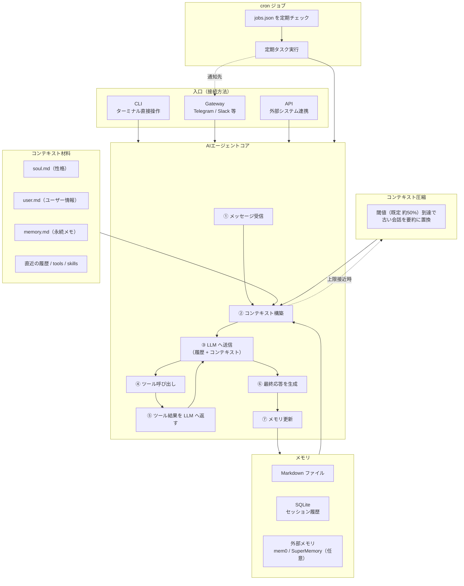

# Hermes アーキテクチャ 解説まとめ

> 出典: Hugging Face / Alejandro AO「Hermesアーキテクチャを徹底解説：メモリ、コンテキスト、ゲートウェイ」
> （動画の公式テキスト版: alejandro-ao.com/hermes-agent-architecture/）

Hermes は「常時稼働型（always-on）」のAIエージェント。巨大なフレームワークではなく、
**ループ + コンテキスト構築 + メモリ + ゲートウェイ + cron** というシンプルな部品の組み合わせで成り立っているのが特徴。

---

## 1. 全体アーキテクチャ（High-Level）

中心に **AIエージェントコア** があり、ここがメッセージ受信・コンテキスト構築・LLM呼び出し・ツール実行・応答生成を担当する。

### Architecture フロー（全体像）

> 流れの要点: **入口（CLI / Gateway / API）→ エージェントコア → コンテキスト構築（ファイル＋メモリ）→ LLM ⇄ ツール → 応答 → メモリ更新**。
> 長くなれば**圧縮**で要約に置換し、**cron** が定期タスクを投入（通知は**ゲートウェイ**経由）。

---

### コアへの接続方法（入口）

エージェントコアへは3つの経路で接続できる。

| 入口 | 形態 | 役割・特徴 |
|------|------|-----------|
| **CLI** | ターミナル | Hermes をローカル実行する最もシンプルで直接的な入口 |
| **Gateway** | 常駐プロセス | Telegram・メール・Slack・Discord・SMS・WhatsApp など外部メッセージングサービスと接続。各サービスごとに個別設定が必要 |
| **API** | エンドポイント | 外部システムをエージェントに連携させるための接続点 |

---

### コア周辺の構成要素
ツール（tools）／スキル（skills）／メモリ（memory）／プロンプトファイル／セッション保存。
これらがあることで「ただのチャットラッパー」ではなくなる。

---

### 中心となるファイル（コンテキスト構築の核）

コンテキストはファイルベースで最小限に保たれる。中心となるのは次の3ファイル。

| ファイル | 位置づけ | 内容 | 更新のされ方 |
|----------|---------|------|-------------|
| **soul.md** | システムプロンプト相当 | エージェントの性格・トーン・目的・行動方針 | 初期は空 or デフォルトにフォールバック（基本は手動設定） |
| **user.md** | ユーザープロファイル | ユーザーについて学んだ情報（例：職業・担当プロジェクト） | 会話から **自動学習・更新** |
| **memory.md** | 汎用の永続メモ | ワークフロー、事実、ツールの使い方など長期保持したい情報（ユーザーに限らない） | 会話中に学んだ内容を蓄積 |

> これら3ファイルはシステムプロンプトの後に **常にコンテキストへ含まれる**。
> さらに毎ターン、直近のメッセージ履歴・ツール説明・スキル説明・（設定時）外部メモリが付加される。

---

## 2. エージェントループ（Agent Loop）

処理の基本的な流れ:

1. ユーザーがメッセージを送る
2. Hermes がそのリクエスト用の **コンテキストを構築**
3. コンテキスト + メッセージ履歴を **LLM へ送信**
4. LLM が必要に応じて **ツールを呼び出す**
5. ツールの実行結果を LLM に返す
6. LLM が **最終応答** を生成
7. 記憶すべき有用な情報があれば **メモリを更新**

> ポイント: 最後の「メモリ更新」が重要。やり取り後に「何を覚えておくべきか」を判断し、
> 次回以降のために書き込む。使うほど賢くなる設計。

---

## 3. コンテキスト構築（Context Construction）

毎ターン LLM へ渡す「材料」。Hermes では意図的に **最小限・ファイルベース** で構成される。

### 中心となるファイル
| ファイル | 役割 |
|----------|------|
| **soul.md** | エージェントの性格・振る舞い。実質的にシステムプロンプト。トーン／目的／行動方針を記述。初期状態では空 or デフォルトにフォールバック |
| **user.md** | ユーザーについて学んだ情報。「自分はこのプロジェクトのエンジニア」等を学習し、以降の文脈に反映 |
| **memory.md** | より広範な永続メモ。ワークフロー、事実、ツールの使い方など長期的に覚えておく情報 |

### 上記に加えて毎ターン付加されるも
直近のメッセージ履歴 / ツールの説明 / スキルの説明 / （設定時）関連する外部メモリ。

---

## 4. コンテキスト圧縮（Context Compression）

長時間動かすとコンテキスト上限に達するため、自動で圧縮する仕組み。

- **しきい値（threshold）**: デフォルトは **モデルのコンテキストウィンドウの約 50%**
  （小さいモデルや小さいウィンドウのモデルでは調整可能）
- しきい値に達すると、古い会話を **要約** し、古いメッセージを要約で置き換える

### 要約が保持する「有用な状態」
- 会話のゴール
- 完了したアクション
- 現在進行中の状態（active state）
- ブロッカー（妨げ要因）
- 重要な決定事項
- 解決済みの疑問
- 関連ファイル
- これまでの要約
- まだ取り込めていないターン

> 実用的エージェント設計で最重要パターンの一つ。
> 「一貫性を保つだけの履歴は残し、生ログを永遠には持たない」。

---

## 5. ゲートウェイ（Gateway）

外部メッセージングプラットフォーム経由で Hermes と会話するための仕組み。

### 対応例
Telegram / Discord / メール / SMS / WhatsApp / Slack

### 重要な前提
- 各プロバイダで連携方式が異なる（**Webhook型** もあれば **ポーリング型** もある）
- 「最初から何にでも繋がる万能ゲートウェイ」は無い → **各ゲートウェイは個別に設定が必要**

### 設定コマンド例（Telegram）
hermes setup gateway
→ Telegram連携と、そのゲートウェイで「home（主）ユーザー」として扱う相手を設定する。

### ゲートウェイの仕事（受信だけではない）
- 外部メッセージを Hermes が扱える形式へ変換（マッピング）
- 正しいセッション履歴を特定
- コンテキストを構築
- エージェントループへ投入

> **セッション識別子（Session ID）が重要**:
> Telegram / Slack / メールスレッド を区別する必要があり、Hermes はセッションをローカル保存して会話を継続する。

---

## 6. メモリ（Memory）

メモリは大きく **3つ** で構成される。

### ① Markdown メモリファイル
`soul.md` / `user.md` / `memory.md`
→ システムプロンプトの後に **常にコンテキストへ含まれる**。

### ② セッション履歴（SQLite）
- 各やり取りを **Session ID** に紐づけて SQLite に保存
- ゲートウェイで特に有用（Telegram会話とメールスレッドで別履歴が必要なため）

### ③ 外部メモリプロバイダ（任意）
- 例: **mem0** / **SuperMemory**（エージェント向けメモリの保存・検索に特化）
- **オプション扱い**。最初は不要なことが多い
- 有効化すると、ローカルの Markdown / SQLite を超えて関連メモリを検索可能

---

## 7. cron ジョブ（Scheduled Tasks）

定期実行タスクの仕組み。ただし **OSの cron プロセスとは別物**。

- Hermes 独自のループが **スケジュール済みジョブをチェック** して実行する

### できること（例）
- 毎朝 AIニュースをメール送信
- Slack に毎日アップデート投稿
- 上司へ週次メッセージ送信
- その他の繰り返しエージェントタスク

### 実装上の注意点
- ドキュメント上は「cronジョブは SQLite に保存」とされる場合があるが、
  実際の実装では **cron ディレクトリ配下の JSON（`jobs.json`）にプレーン保存** されている
- Hermes は一定間隔で `jobs.json` を確認し、見つけたジョブを実行する

### ゲートウェイとの連携
- cronジョブは「どこへ送るか」を自動では知らない
- Telegram / Discord / Slack 等へ通知したい場合は、**対応するゲートウェイの設定が必須**

---

## 8. なぜこのアーキテクチャが機能するのか

個々の部品はシンプル:
ループ / コンテキストビルダー / メモリファイル / SQLiteセッション / 任意の外部メモリ / ゲートウェイ / スケジュールジョブ。

**強さは「組み合わせ方」から生まれる。**
ターミナルからも使え、メッセージアプリからも到達でき、有用な情報を記憶し、長い会話を圧縮し、
バックグラウンドタスクも回せる ——— これが常時稼働エージェントの実用的な構成。

> 巨大なフレームワークは不要。必要なのは
> **きれいなループ・明確なコンテキストモデル・信頼できるメモリ・人々の実際の連絡手段に合った連携点**。

---

## 設定内容クイックリファレンス

| 項目 | デフォルト / 内容 |
|------|------------------|
| コンテキスト圧縮しきい値 | 約 50%（小型モデルでは調整可） |
| 性格設定 | `soul.md`（初期は空 or デフォルト） |
| ユーザー情報 | `user.md`（学習で自動更新） |
| 永続メモ | `memory.md` |
| セッション履歴 | SQLite（Session IDで管理） |
| 外部メモリ | mem0 / SuperMemory（任意） |
| ゲートウェイ設定 | `hermes setup gateway` |
| cronジョブ保存先 | `cron/jobs.json`（プレーンJSON） |