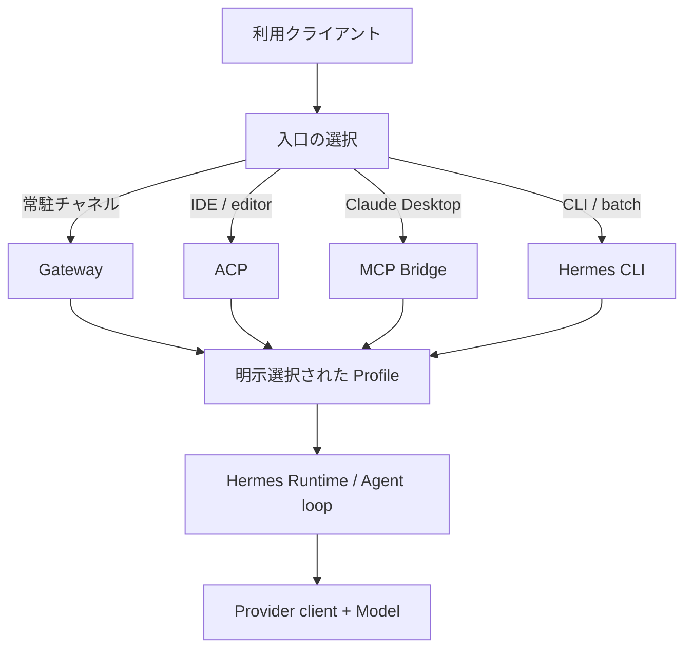
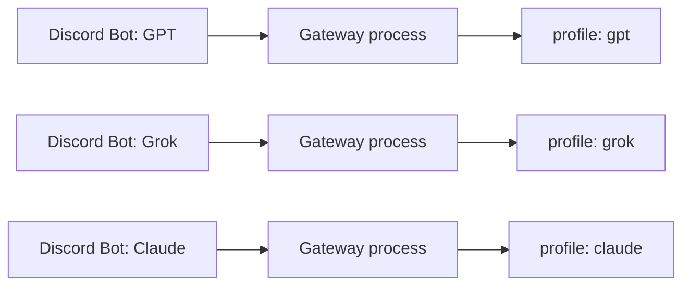
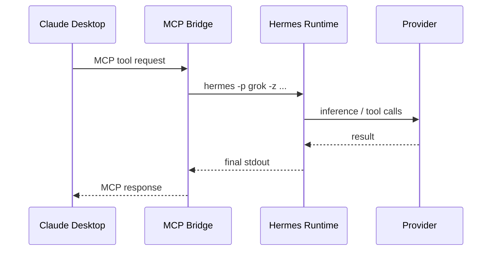
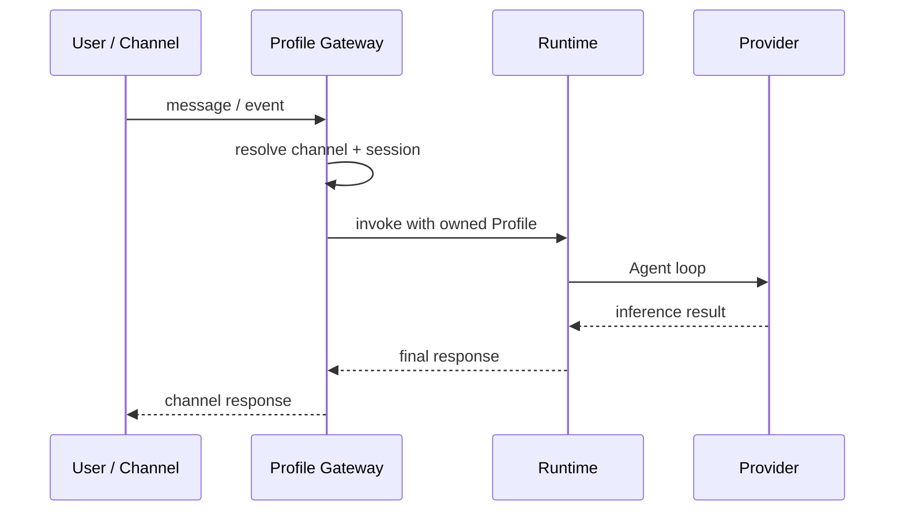
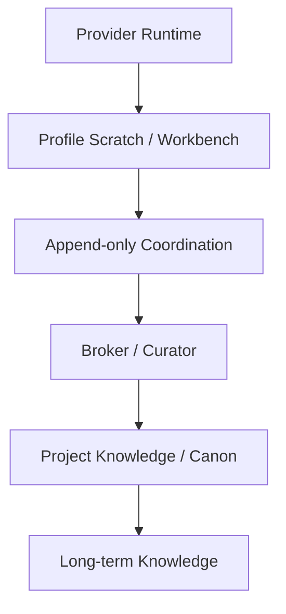

# Hermes Agent 最新アーキテクチャ設計書

> 対象: 新規参加開発者  
> 版: 1.0  
> 基準日: 2026-07-15  
> ステータス: 現行構成と次段階の設計境界を統合したオンボーディング用設計書

---

## 0. この文書の目的

Hermes Agent は、単に外部 LLM を呼ぶための MCP ツールではない。**Provider の認証・モデル接続状態を保持し、自身で Agent loop を実行する Runtime 基盤**である。

本システムでは、Hermes を複数の Provider、クライアント、常駐 Bot から安全に使うため、次の4概念を明確に分離する。

| 概念 | 一言でいうと | 主な責務 |
|---|---|---|
| **Gateway** | 常駐する入口 | Discord / Telegram / Slack / cron 等からイベントを受け、指定 Profile の Runtime を起動・維持する |
| **Runtime** | Agent の実行主体 | Provider client、Agent loop、ツール実行、会話コンテキストを扱う |
| **Bridge** | 異なるプロトコル間の変換器 | MCP / stdio 等の要求を Hermes CLI・Runtime 呼び出しへ翻訳し、結果を同期返却する |
| **Profile** | 実行状態の隔離単位 | Provider binding、model、OAuth/API 認証、channel 設定、セッション、ログ等を名前付きで分離する |

最重要原則は次の2つである。

1. **共有してよいものと、可変状態として隔離すべきものを分ける。**
2. **1つの可変状態には1つの所有主体を置く。**

この原則は Runtime 層だけでなく、後段の Knowledge / Memory 層にも一貫して適用する。

---

## 1. まず理解すべき全体像

### 1.1 現行の論理構成



入口は複数あるが、最終的には必ず1つの **Profile** を選び、その Profile に属する **Runtime** が処理する。

重要なのは、Gateway・ACP・Bridge・CLI が別々の Agent 本体なのではない点である。これらは **Runtime に到達する異なる入口または transport** であり、Agent loop の主体は Runtime にある。

### 1.2 現行の代表的な入口

| 利用場面 | 入口 | 実行特性 | 代表例 |
|---|---|---|---|
| Discord / Telegram / Slack | `hermes gateway` | 常駐・イベント駆動 | Provider ごとの Bot |
| IDE / editor | `hermes acp` | 対話セッション・IDE 統合 | ACP 対応クライアント |
| Claude Desktop | カスタム MCP Bridge → `hermes -p <profile> -z` | 同期・one-shot | `grok_oauth_bridge.py` |
| terminal / task runner | `hermes -p <profile> ...` | 対話または one-shot | 手動検証、バッチ |

### 1.3 退役した経路

次は現行の中心経路ではなく、履歴・互換資料としてのみ扱う。

| 経路 | 状態 | 理由 |
|---|---|---|
| Grok-UI / grok.com 連携 | 退役 | 現在は Hermes Runtime を直接利用するため |
| `hermes proxy` の中央集約 | 退役 | Grok-UI 用の OpenAI 互換入口として Provider/OAuth 状態を中央所有していた旧構成 |
| グローバルな Provider 選択への依存 | 禁止方向 | 複数 Agent / Gateway 稼働時に binding が競合・漂流するため |

`hermes proxy` 自体が一般論として不要なのではない。**現在のシステムでは、それを中核に置くユースケースが退役した**という意味である。

---

## 2. コンポーネント責務

### 2.1 Gateway

Gateway は Discord 等の外部チャネルに対する **常駐プロセス**である。イベント受信、セッション継続、メッセージ送受信、定期実行の入口を担当する。

Gateway が担うもの:

- channel 接続とイベント待受
- channel / conversation と Hermes session の対応づけ
- 対象 Profile の設定読み込み
- その Profile に属する Runtime 呼び出し
- Profile 単位のログ出力と障害境界

Gateway が担わないもの:

- 複数 Provider 間で共有される可変 binding の管理
- Project Knowledge の正本編集
- LLM 間の成果を自動で canon 化する Broker の役割
- MCP と Hermes のプロトコル変換

#### Gateway 分離の理由

Gateway は起動時に Profile の設定を読み、プロセス内に保持する。したがって、複数 Provider / Bot を同時常駐させる場合は、**Gateway プロセス自体を Profile ごとに分離**する。



1つの Gateway で動的に Provider を切り替える構成は、設定・セッション・障害の所有権を曖昧にするため採用しない。

---

### 2.2 Runtime

Runtime は Hermes Agent の本体である。外部 LLM を単発で呼ぶだけの薄い API client ではなく、以下を保持・実行する。

- Provider client
- model / provider binding
- OAuth または API key による認証状態
- Agent loop
- tool selection / tool execution
- session と短期会話コンテキスト
- hooks / approval / execution policy
- Runtime エラーと再試行の制御

#### Runtime と MCP tool の違い

MCP tool は「外部機能を呼ぶための操作面」である。一方 Runtime は「推論とツール利用を繰り返し、タスクを完了させる実行主体」である。

したがって、Hermes を単なる `ask_grok` ツールとして説明すると、次の重要な状態が見えなくなる。

- 認証済みでも binding が外れていれば推論できない
- 同じ Provider でも Profile が違えば設定・セッション・ログは別である
- 入口が Discord、ACP、MCP のどれでも、最終的な Agent loop は Runtime が所有する

---

### 2.3 Bridge

Bridge は **protocol adapter / transport adapter** である。

代表例 `grok_oauth_bridge.py` は、Claude Desktop の MCP 要求を受け、Hermes の one-shot 実行へ変換し、stdout を MCP response として同期返却する。



Bridge が所有するもの:

- 入出力スキーマ変換
- subprocess 起動条件
- `-p <profile>` の明示
- `HERMES_HOME` 等、Runtime を正しい設定領域へ導く環境指定
- timeout、stdin、stdout/stderr、文字コード処理
- 呼び出し可能な toolset と workdir のガードレール

Bridge が所有しないもの:

- Provider credential の正本
- model / provider binding の動的共有状態
- Agent の長期記憶
- Project Knowledge の正本
- 複数 Provider のルーティング判断

#### 技術 Bridge と `bridges/` knowledge 領域を混同しない

本システムでは「Bridge」という語が2種類の文脈に現れる可能性がある。

| 用語 | 意味 | 書込主体 |
|---|---|---|
| Runtime Bridge | MCP / stdio / CLI 間の技術的変換コード | 担当開発者が通常のレビュー手順で保守 |
| `bridges/` knowledge 領域 | Project 間で再利用する蒸留済み知識 | Broker 役のみ。`coordination` → Broker 蒸留 → ミナト承認で昇格 |

運用 Agent が後者を直接整備してはならない。名称が同じでも、前者は transport、後者は knowledge governance であり、責務は別物である。

---

### 2.4 Profile

Profile は、Provider ごとの実行状態を隔離する **名前付きの構成・状態境界**である。

概念上、次のような情報を Profile に閉じ込める。

```text
profiles/
├─ gpt/
│  ├─ config.yaml
│  ├─ .env
│  ├─ auth.json
│  ├─ sessions/
│  └─ logs/
├─ grok/
│  └─ ...
└─ claude/
   └─ ...
```

実ファイル名や保存位置は Hermes の版に従う。重要なのはディレクトリ名ではなく、次の所有関係である。

| 状態 | 所有単位 | 備考 |
|---|---|---|
| Provider / model binding | Profile | 認証とは別状態 |
| OAuth / API credential | 原則 Profile | 同一外部アカウントを使えば quota は共有され得る |
| channel 設定 | Profile | Gateway と対応させる |
| session / short-term context | Profile / session | 他 Profile と混在させない |
| Runtime log | Profile / process | 障害切り分けの基本単位 |
| Project Knowledge | Project 側の canon | Profile に閉じ込めない |

#### Profile 分離が保証するもの／しないもの

Profile 分離が保証する:

- ローカルの設定競合を抑える
- Provider / model binding の混線を防ぐ
- session、log、channel の追跡可能性を高める
- Gateway 障害を別 Provider へ波及させにくくする

Profile 分離だけでは保証しない:

- 同一 OAuth アカウントの quota 分離
- 外部 Provider 側の rate limit 分離
- OS process の完全分離
- Project Knowledge の更新競合防止

外部アカウントが同じなら、token store の物理配置が別でも、Provider 側の利用枠は同じである。

---

## 3. 二重の分離: Gateway 隔離と Profile 明示

複数 Provider を安全に常駐運用するには、次の2つを同時に満たす。

### 3.1 プロセス境界: Gateway を Profile ごとに分ける

各 Gateway は自分の Profile 設定だけを読み、別プロセスとして常駐する。これにより、プロセス内キャッシュ、session、ログ、再起動範囲を分離する。

### 3.2 選択境界: すべての入口で `-p <profile>` を明示する

Bridge、one-shot、運用スクリプト、手動 CLI から Hermes を呼ぶときは、暗黙の default Profile に依存しない。

```powershell
# Grok Profile を使う one-shot
hermes -p grok -z "<prompt>" -t x_search,vision --accept-hooks

# GPT Profile の状態確認
hermes -p gpt status
```

`-p grok` の `grok` は Provider 名を直接指定する魔法の引数ではなく、**Grok に binding された Profile 名を選ぶ指定**である。この区別により、将来 Profile 名と Provider 名が一致しない構成にも対応できる。

### 3.3 なぜ両方必要か

| Gateway 分離 | `-p` 明示 | 結果 |
|---|---|---|
| なし | なし | binding、session、障害範囲が最も曖昧。禁止 |
| あり | なし | 常駐系は分かれても、Bridge / CLI が default を踏み誤る |
| なし | あり | 呼出先は決まるが、常駐プロセスの状態・再起動範囲が混在する |
| **あり** | **あり** | 現行の採用構成 |

---

## 4. OAuth session と Provider binding は別物

障害切り分けで最も重要な境界である。

| 状態 | 意味 | 典型的な確認 |
|---|---|---|
| OAuth session / credential | Provider に接続する権利がある | auth status、credential file、再ログイン |
| Provider binding | どの Provider / model を推論先として使うか | profile status、active provider/model、model 再選択 |

次の状態は両立する。

```text
OAuth: logged in
Provider binding: broken or stale
Result: 認証済みに見えるが、推論は空応答または失敗
```

したがって「ログイン済みだから Provider 接続も正常」と判断してはならない。空応答時は、まず単純な推論を Bridge なしで実行し、その後に Profile の active provider / model を確認する。

### 推奨切り分け順

1. `hermes -p <profile> status` で Profile・model・provider を確認する。
2. ツールなしの最小 prompt を `hermes -p <profile> -z` で直接実行する。
3. 失敗するなら OAuth と binding を別々に確認する。
4. CLI 直実行が通るなら Bridge の env、timeout、encoding、引数を確認する。
5. 検索だけ失敗するなら tool enable、tool provider、`-t` を確認する。

---

## 5. Runtime 起動フロー

### 5.1 Gateway 経路



### 5.2 ACP 経路

ACP は IDE / editor と Hermes Runtime を接続する。IDE は Agent の表示・操作面であり、Provider client と Agent loop の所有主体は Hermes Runtime 側にある。

### 5.3 MCP Bridge 経路

Claude Desktop からの Bridge は one-shot subprocess を使う。低頻度・同期ツールとして単純で堅牢だが、起動ごとのオーバーヘッドがある。

Bridge 実装では少なくとも次を固定する。

```text
profile        = 明示指定
stdin          = DEVNULL
timeout        = 長時間検索を考慮した有限値
encoding       = UTF-8
decode errors  = replace 等で診断情報を失わない
toolsets       = 最小権限
workdir        = 許可ルート内
```

Windows では `text=True` の既定 decode が cp932 になり、日本語 UTF-8 出力で stdout が空に見える事故があった。Hermes の stdout は `encoding="utf-8", errors="replace"` で扱う。

---

## 6. 状態とデータの境界

### 6.1 共有禁止の可変状態

次は Provider / Profile 間で共有しない。

- active provider / model binding
- session context
- Profile 固有 scratch
- process-local cache
- Gateway の channel session mapping
- 実行途中の plan / tool result

### 6.2 共有可能だが所有者が必要な状態

次は共有対象になり得るが、直接の多者書込は禁止する。

- Project Knowledge / canon
- 設計上の採用決定
- 共通 operating rule
- Project 横断の `bridges/` knowledge

### 6.3 共有してよい不変または参照データ

- 公開ドキュメント
- version 固定された source
- read-only reference
- 承認済み canon snapshot

---

## 7. Memory / Knowledge アーキテクチャとの接続

Runtime 分離は Provider の実行競合を防ぐ。Knowledge 分離は複数 LLM の解釈や作業途中の状態が正本へ直接混入するのを防ぐ。



| 層 | 内容 | 更新規則 |
|---|---|---|
| L0 Session | 現在の会話・実行コンテキスト | Runtime / session 単位で可変 |
| L1 Profile Working Memory | Provider 固有の scratch、仮説、作業理解 | Profile 単位。共有しない |
| Coordination | 成果・提案・判断材料 | append-only。正本ではない |
| L2 Project Knowledge / Canon | 現在採用されている Project 知識 | 単一所有。Broker が蒸留 |
| Long-term | Obsidian / NotebookLM / Git 等 | 承認済み知識を用途別に保持 |

ここでいう canon は「永遠の真実」ではなく、**現在その Project で採用されている運用上の正本**である。

### Broker と Router を分ける

| 役割 | 判断対象 |
|---|---|
| Router | どの Profile / Provider / Agent に仕事を渡すか |
| Planner | タスクをどう分解・順序化するか |
| Broker / Curator | どの成果を共有 Knowledge へ昇格するか |

Router が自動的に canon を書き換えてはならない。実行経路の選択と、知識の正本化は異なる権限である。

### 現在の到達点

- Provider 別 Runtime / Profile の分離基盤: 実装・運用段階
- Gateway の Profile 別常駐: 運用段階
- ACP / Bridge / CLI の複数入口: 利用段階
- Profile scratch → coordination → Broker → canon: 設計・段階導入中
- 自律的な完全 Multi-Agent orchestration: 未完成

したがって現状を「完成済み Multi-Agent System」とは表現しない。正確には、**複数 Provider Runtime を安全に並置し、Knowledge Production System へ接続するための基盤が整った段階**である。

---

## 8. セキュリティと権限設計

### 8.1 最小権限

Bridge の `-z` one-shot は approval を自動バイパスする場合がある。安全性は次の組み合わせで担保する。

- `-t` で tool / toolset を最小化する
- terminal / computer-use を既定で渡さない
- workdir を許可ルートへ限定する
- 機密 Vault や正本領域を明示拒否する
- timeout を必ず設ける
- stderr と return code を診断可能にする

### 8.2 既知の Grok Bridge ガードレール

- 許可ルート: `C:\Python\REX_AI` 配下
- 明示拒否: `C:\Python\REX_AI\REX_Brain_Vault` 配下
- 質問系: `x_search,vision` を中心とした read-only 構成
- 作業系: 必要な toolset のみを許可し、workdir を検証

具体値は実装と運用ポリシーの最新版を優先する。

### 8.3 Secret の扱い

- `.env`、`auth.json`、OAuth token、API key を Git 管理しない
- ログへ credential を出力しない
- Profile 間で secret をコピーして「同期」しない
- 同一外部アカウントを使う場合も、ローカル所有関係と quota 共有を別々に記録する

---

## 9. 障害モデルと診断表

| 症状 | 第一候補 | 確認点 |
|---|---|---|
| `logged in` だが空応答 | binding drift | active provider / model を確認・再選択 |
| 別 Provider が応答する | default Profile 依存 | すべての起動に `-p <profile>` があるか |
| 一方の Bot 再起動が他へ影響 | Gateway 未分離 | process と log の所有 Profile を確認 |
| Bridge だけ timeout | `HERMES_HOME` / profile / stdin | CLI 直実行との差分を確認 |
| ASCII は通るが日本語結果が空 | decode 不一致 | UTF-8 明示、cp932 依存排除 |
| 通常応答は通るが X 検索だけ空 | tool 構成 | enable、tool provider、`-t x_search` |
| Bridge 修正が反映されない | 古い MCP subprocess 残留 | クライアントと子プロセスを完全終了 |
| Profile を分けたのに quota 競合 | 外部アカウント共有 | Provider 側 subscription / rate limit を確認 |
| canon に矛盾が混入 | 多者直接書込 | coordination と Broker ownership を確認 |

### 診断の鉄則

1. **入口を外す**: Bridge / Gateway を介さず Hermes CLI を直接試す。
2. **ツールを外す**: 最小 prompt で推論自体を確認する。
3. **認証と binding を分ける**: 両方を独立に確認する。
4. **Profile を固定する**: default 依存を排除する。
5. **外部制限を確認する**: quota / rate limit は Profile 隔離では消えない。

---

## 10. 実装規約

### 10.1 新しい Provider Profile を追加する場合

1. 新規 Profile を作成する。
2. Provider credential をその Profile で設定する。
3. provider / model binding を明示する。
4. `hermes -p <profile> status` を記録する。
5. ツールなし one-shot を検証する。
6. 必要な tool provider と toolset を検証する。
7. 常駐利用する場合は専用 Gateway process を作る。
8. Bridge / ACP / script の入口で Profile を明示する。
9. log、session、restart 手順を Profile 単位で文書化する。
10. 同一 OAuth アカウント利用時は quota 共有を記録する。

### 10.2 新しい Bridge を追加する場合

Bridge は薄く保つ。

- Profile 選択を引数または固定設定として明示する
- Provider 判定ロジックを埋め込まない
- credential を保持しない
- Runtime の長期状態を複製しない
- input validation と output normalization に集中する
- timeout / encoding / stderr / return code を扱う
- toolset / workdir を最小権限で制限する

### 10.3 新しい Gateway を追加する場合

- 1 Gateway = 1 owned Profile を原則とする
- 起動コマンド、PID、port、channel、log path を識別可能にする
- OS 起動時の順序と restart policy を定義する
- health check は「process alive」だけでなく最小 inference まで分けて考える
- 他 Gateway の config / session を参照しない

---

## 11. 設定・命名の推奨

### Profile 名

Provider 名だけでなく、役割や環境を含めてもよい。

```text
grok
gpt
claude
grok-research
gpt-broker
claude-dev
```

ただし Profile 名と Provider 名を同義とみなすコードは書かない。

### Process 名・ログ名

最低限、次を識別できる名前にする。

```text
gateway-grok
gateway-gpt
gateway-claude
bridge-grok-oauth
acp-gpt
```

ログには、secret を除き次の相関情報を持たせる。

- timestamp
- profile
- entrypoint
- session / conversation correlation id
- provider / model
- toolset
- exit status / timeout

---

## 12. 変更時の設計チェック

新機能や構成変更をレビューするときは、次の順で問う。

1. この機能の **状態所有者**は誰か。
2. その状態は不変か、append-only か、可変か。
3. 可変なら Profile / process / Project のどこに隔離するか。
4. 入口は Gateway、ACP、Bridge、CLI のどれか。
5. Runtime の責務を入口側へ重複実装していないか。
6. OAuth credential と provider binding を混同していないか。
7. default Profile に暗黙依存していないか。
8. 正本 Knowledge への書込経路は単一所有か。
9. 障害時に1つの Profile / process だけを止められるか。
10. 同じ外部アカウントの quota 共有を隔離済みと誤認していないか。

---

## 13. 新規参加者向け最短オンボーディング

### 最初に読む順番

1. 本設計書
2. `docs/Grok_OAuth_Bridge_Architecture.md` — Bridge 構築と障害知見の履歴
3. `docs/MCP_Commands_Reference.md` — 利用可能な MCP と入口
4. 現行の Profile 設定・Gateway 起動定義
5. Project 側の `AGENTS.md` / coordination / canon 規約

古い資料に `hermes -z` だけが書かれている場合は、Profile 分離後の実行では `hermes -p <profile> -z` と読み替える。古い Proxy / Grok-UI 記述は履歴として扱う。

### 最初の動作確認

```powershell
# 1. 対象 Profile の状態
hermes -p grok status

# 2. ツールなし最小推論
hermes -p grok -z "2+2を数字だけで答えて"

# 3. 必要なツールを限定して確認
hermes -p grok -z "X検索の接続確認をして" -t x_search --accept-hooks
```

確認後、Gateway または Bridge 経路を試し、CLI 直実行との差分を記録する。

---

## 14. 用語集

| 用語 | 定義 |
|---|---|
| Agent loop | 推論、ツール実行、結果観測、再推論を反復する実行ループ |
| Provider | OpenAI、xAI、Anthropic 等の推論サービス |
| Provider client | Provider API / OAuth 接続を実行する Runtime 内部の client |
| Binding | Profile を特定 Provider / model に結びつける設定状態 |
| Credential | OAuth token や API key 等の接続資格情報 |
| Profile | binding、credential、session、channel、log 等の隔離単位 |
| Gateway | 外部 channel / cron の常駐入口 |
| Bridge | 異なる protocol / process 間の変換器 |
| ACP | IDE / editor と Agent Runtime を接続する protocol / entrypoint |
| Coordination | 複数 Agent の成果を append-only で集める領域。正本ではない |
| Broker | coordination から採用知識を蒸留し canon へ昇格する単一所有役 |
| Canon | Project で現在採用されている運用上の正本知識 |

---

## 15. 結論

Hermes Agent の最新構成は、次の1文に要約できる。

> **複数の入口を、明示選択された Profile と Profile 専用プロセス境界を通して Hermes Runtime へ接続し、Provider 固有の可変状態は隔離しつつ、共有すべき成果だけを Broker 経由で Project Knowledge に昇格する。**

Gateway、Runtime、Bridge、Profile は代替関係ではない。それぞれが「常駐入口」「実行主体」「変換路」「状態境界」という異なる責務を持つ。この分離を崩さないことが、Provider 追加、Multi-Agent 化、Knowledge Production System への発展を安全に進める前提となる。

---

## 付録A. 現行構成と履歴資料の読み替え

| 履歴資料の表現 | 現在の読み方 |
|---|---|
| `hermes -z ...` | 原則 `hermes -p <profile> -z ...` |
| 1つの `HERMES_HOME` | Profile ルートと明示 Profile 選択を併用 |
| Hermes Proxy 中央集約 | Grok-UI 用の退役構成 |
| Grok OAuth Bridge が Hermes を呼ぶ | 有効。ただし Profile を明示し Runtime 状態を Bridge に持たせない |
| Hermes MCP = Hermes Agent | 誤り。Hermes MCP は messaging 操作面の1つで、Agent 本体は Runtime |
| Profile を分ければ完全独立 | 誤り。外部 OAuth アカウントの quota は共有され得る |

## 付録B. 設計決定記録の要約

| 決定 | 採用理由 |
|---|---|
| Profile ごとの Gateway process | process-local state と障害範囲を分離する |
| 全入口で Profile 明示 | global/default binding への依存をなくす |
| Bridge を薄い adapter に限定 | Runtime state と routing logic の二重所有を防ぐ |
| OAuth と binding を別状態として診断 | 認証済み空応答を正しく切り分ける |
| mutable state を共有しない | Provider 間の競合と再現不能な漂流を防ぐ |
| canon は Broker 単一所有 | 複数 Agent の直接書込による矛盾を防ぐ |
| Router と Broker を分離 | 実行先選択と知識昇格の権限を分ける |
